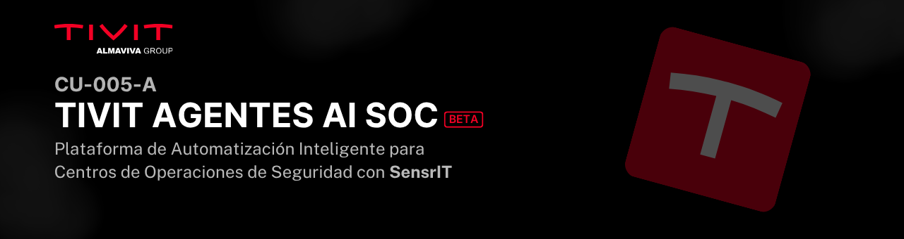

<p align="center">
  <!-- Reemplaza el enlace de abajo con la URL de tu banner -->
  
</p>

# AI SOC Email Collector 🚀

Un servicio robusto y autónomo en Python diseñado para el **Centro de Operaciones de Seguridad (SOC)**. Este microservicio se encarga de monitorizar buzones de correo (vía Gmail API), extraer alertas de incidentes de seguridad estructuradas, parsear el contenido inteligentemente y enviarlas en formato JSON a un servicio central de ingesta.

Está diseñado para alta volumetría, cuenta con control de duplicados en base de datos, y está completamente optimizado para su despliegue en producción con Docker.

---

## ✨ Características Principales

- **Autenticación Segura (OAuth 2.0)**: Uso de tokens de refresco (sin necesidad de delegación de dominio) para mantener un acceso ininterrumpido a la cuenta de monitoreo de Gmail.
- **Filtros Inteligentes de Origen**: Monitorea de forma exclusiva a remitentes específicos definidos por variables de entorno y solo lee correos recientes (últimos 7 días).
- **Procesamiento Concurrente de Alta Volumetría**: Procesamiento multi-hilo a través de `ThreadPoolExecutor`, capaz de consumir, analizar y exportar decenas de correos en paralelo.
- **Sistema Anti-Duplicados**: Utiliza una base de datos local SQLite (en modo `WAL` de alta eficiencia) para registrar el `message_id` procesado y asegurar la idempotencia (un evento nunca se envía dos veces).
- **Automantenimiento Integrado**: Rutina automática que purga los datos procesados más antiguos a 7 días, manteniendo el contenedor limpio y eficiente.
- **Parser de Extracción Inteligente**: Extrae dinámicamente campos complejos desde el _cuerpo_ del correo de alertas (Solicitante, Categoría, Tercer nivel y Descripción Multilínea).
- **Manejo Resiliente de Red**: Timeouts configurables de 30 segundos y control de excepciones para manejar "Cold Starts" en Cloud Run.

---

## 🏗️ Arquitectura del Servicio

El flujo de procesamiento (`main.py`) opera en los siguientes ciclos:

1.  **Limpieza Automática**: Cada 24 horas libera espacio en disco y ejecuta `VACUUM`.
2.  **Polling (Consulta)**: Consulta la API de Gmail (ej. cada 60s) usando OAuth.
3.  **Deduplicación Lógica**: Identifica si el ID ya fue procesado con éxito anteriormente.
4.  **Distribución (Workers)**: Reparte los mensajes nuevos a los hilos de trabajo paralelos.
5.  **Extracción de Metadatos**: El Parser lee el Subject y el Body, buscando las etiquetas predefinidas (SensrIT schema).
6.  **Ingesta (HTTP POST)**: Envía el JSON formateado al API de Ingesta central.
7.  **Registro y Logs**: Guarda el resultado en `app.log` o Stdout y actualiza SQLite.

---

## 🛠️ Requisitos Previos

1.  **Credenciales OAuth**: Archivo `credenciales.json` (Client ID y Client Secret tipo Desktop/Web Application desde GCP).
2.  **Refresh Token**: El token generado tras tu primer y único login manual.
3.  **Docker & Docker Compose**: Recomendado para despliegue en servidores (VPS).

---

## 🚀 Guía de Instalación y Despliegue

### 1. Preparación del Entorno

Clona este repositorio en tu VPS o máquina local:

```bash
git clone <url-de-tu-repo>
cd tivit-agentes-ai-soc-collector
```

Crea tu archivo de variables de entorno:

```bash
cp .env.example .env
```

### 2. Configuración (`.env`)

Edita el archivo `.env` e ingresa tus valores. Asegúrate de configurar correctamente el remitente y la API de envío:

```ini
# Gmail Configuration
OAUTH_CREDENTIALS_FILE=credenciales.json
GMAIL_REFRESH_TOKEN=tu_refresh_token_aqui_generado_por_oauth_py
GMAIL_SENDER_FILTER=remitente.alertas@dominio.com
GMAIL_QUERY=from:remitente.alertas@dominio.com newer_than:7d
POLLING_INTERVAL=60
MAX_WORKERS=5

# Database Configuration
DB_PATH=data/collector.db

# Ingestion Configuration
INGESTION_ENDPOINT=https://tu-api-cloud-run/api/v1/ingest/offense
INGESTION_API_KEY=TuSuperApiKeySegura
```

### 3. Autenticación Google (Primera vez)

Coloca tu archivo `credenciales.json` en la raíz del proyecto. Si aún no tienes un **Refresh Token**, ejecuta el script `oauth.py` localmente una vez:

```bash
python oauth.py
```

_(Copia el `Refresh Token` que aparece en la consola y ponlo en tu `.env`)_.

### 4. Construcción y Despliegue (Producción)

Dado que SQLite y las dependencias están optimizadas en Python 3.11-slim, la construcción es rápida y liviana:

```bash
docker-compose up -d --build
```

Esto levantará el contenedor `soc-email-collector` en segundo plano.

---

## 🪵 Monitoreo y Mantenimiento

**Ver los Logs Estructurados en Tiempo Real:**

```bash
docker-compose logs -f
```

**Ver el registro histórico (si se necesita acceso interno al file.log):**

```bash
docker exec -it soc-email-collector cat app.log
```

**Reiniciar en caso de actualización:**

```bash
docker-compose down
docker-compose up -d --build
```

---

## 📂 Estructura del Proyecto

```text
/
├── app/
│   ├── __init__.py
│   ├── config.py         # Carga de variables del sistema
│   ├── db.py             # SQLite, modo WAL y políticas de vida (7 días)
│   ├── gmail_client.py   # Integración con Google API Auth
│   ├── logger.py         # Logs estructurados y salidas sys.stdout
│   ├── main.py           # Ciclo principal de procesamiento e hilos
│   ├── parser.py         # Extracción de entidades por Regex
│   └── sender.py         # Solicitudes POST al endpoint
├── .env.example
├── .gitignore
├── credenciales.json.example   # Modelo del Client OAuth
├── docker-compose.yml          # Reglas del VPS
├── Dockerfile                  # Base Python-Slim
├── oauth.py                    # Utilidad manual para generar tokens
├── requirements.txt            # Dependencias
└── test_collector.py           # Unit tests de procesamiento local
```

---

_Desarrollado para la integración automatizada e inteligente de Eventos de Seguridad._ 🛡️
